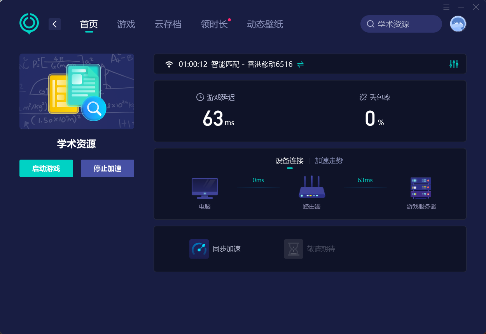
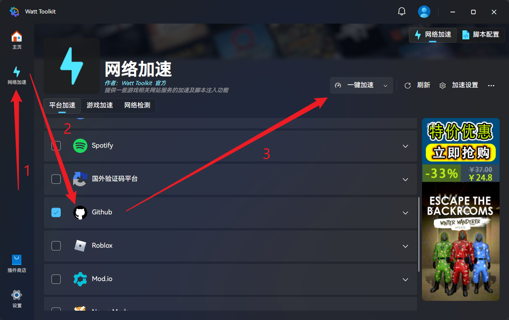
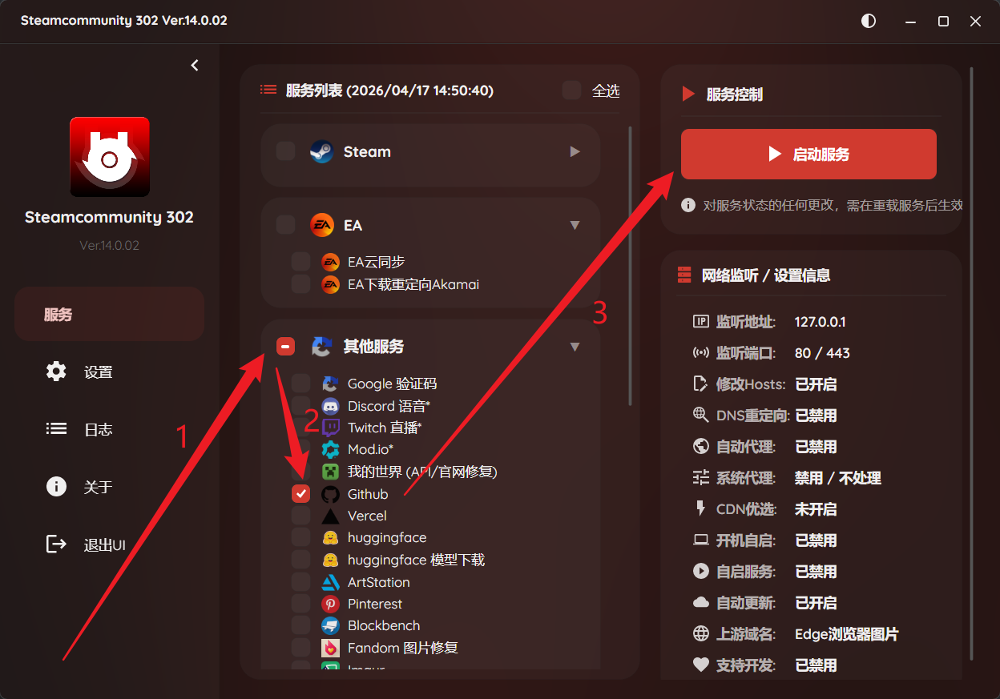
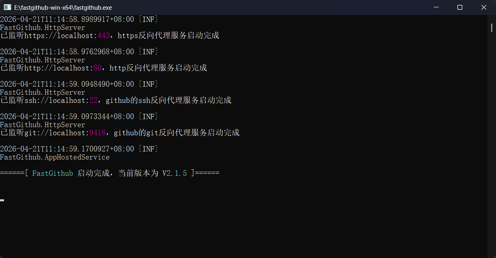
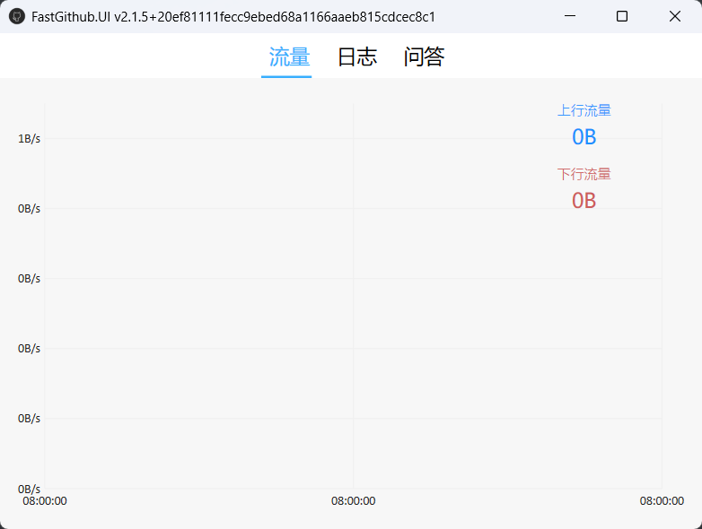
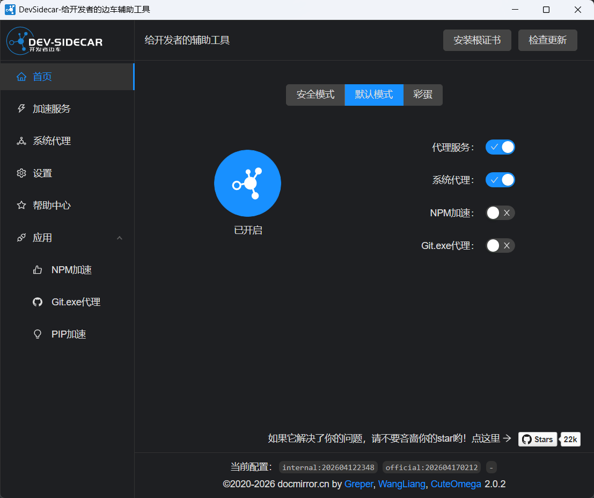
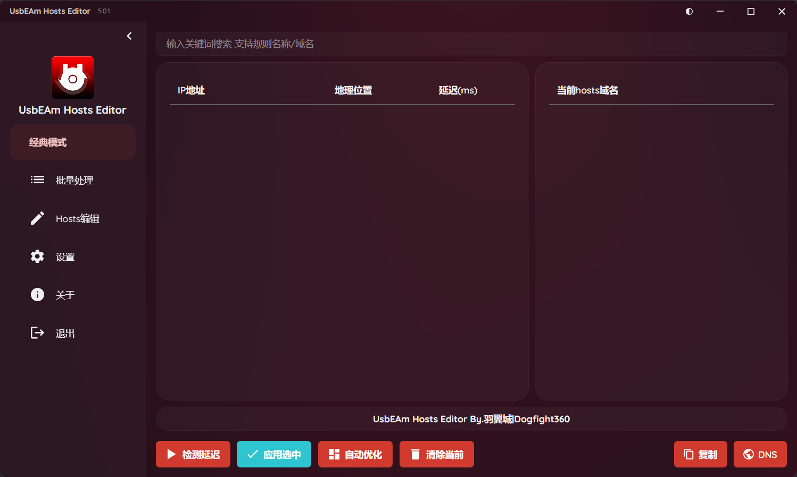

# 如何不使用 VPN 加速使用 GitHub 和 Git

使用国内访问 GitHub 以及使用 Git Clone、Git Pull时，由于其 DNS 受到污染，所以大概率会出现访问不了或者加载不完全的问题

下面提供几种方法供大家加速进入 GitHub 以及更好的使用 Git

:::danger
VPN 作为最快、基本最稳定访问手段，由于涉及相关法律法规等，文章不做介绍

本指南仅适用于初学者，有**合法** VPN 相关条件直接使用即可，不必参考本指南

以下方法**仅需选择一种**使用，切勿同时启用 VPN + 本文任一加速方式或同时启用文章中的任意两种及以上方式，否则可能导致网络故障，相关后果需**自行承担**。

关闭计算机之前需注意**关闭所有**加速方式，确保按钮处于关闭状态而非**直接关闭应用窗口**，否则再开机可能导致网络异常

本文推荐工具均来自官方/开源平台，请务必从正规渠道下载，切勿使用陌生网站提供的安装包。

使用前建议开启电脑杀毒软件，保障设备安全。

不随意安装未知证书、不信任插件，避免计算机出现安全风险。

所有操作均为网络加速优化，不会对电脑造成损害，可放心使用。
:::

:::info
版权声明：
本文为 CapableCCat <CapableCCat@gmail.com> 原创技术分享，仅供学习交流使用，禁止未经授权转载、商用或用于其他用途。
如需引用，请注明来源：CapableCCat <CapableCCat@gmail.com> 技术教程。
:::

## 加速器加速

### 厂商级加速器

想必闲暇时间大家基本会在电脑上打打游戏

那么为了提升自己的游戏体验，游戏加速器是必不可少的，国内外都有很多厂商提供游戏加速服务

而其中一些游戏加速器也内置了 **【学术资源】板块** 用于加速常用的学术网站，比如：

#### 网易UU加速器（免费）

下载链接：[网易UU加速器-不止快，还很稳](https://uu.163.com/)

安装注册登录好之后，在搜索栏直接搜索 **【学术资源】**，之后点击 **加速** 即可，**完全免费**

开始加速后会打开默认浏览器并跳转到一个导航界面，里面存放着很多学术网站跳转链接

里面是没有 GitHub 选项的，但是据笔者测试，GitHub 也能够很快进入

:::tip
UU加速器 是文章中除 VPN 之外能够**最快，最稳定**访问 GitHub 的方式，而且是**免费**的
:::

-----

#### 小黑盒加速器（付费）

下载链接：[小黑盒加速器 - 全球专线加速，游戏网络专家](https://acc.xiaoheihe.cn/pc)

小黑盒是很多玩家讨论游戏以及其他技术领域等的一个论坛类软件，官方也提供加速器软件

安装注册登录好之后，同样是搜索学术资源，添加之后选择加速即可

:::note
很可惜，小黑盒加速器是需要付费的，之所以推荐是因为有一部分游戏玩家会使用该加速器并充值 VIP

加上主流加速器中基本只有这两家有，所以一并推荐了

（如果读到的你认为的主流和我认为的主流不一样，或者你发现了其他“主流”加速器也有学术资源加速，以你的为准 LOL）
:::

### 个人级加速器

Steam 作为全球游戏用户最多的游戏提供平台，大家很多喜欢的游戏都是从上面购买的对吧

但是很容易遇到无法登录，登录卡顿或者登录之后无法加载等的问题，所以会使用加速器，比如上面推荐的

但是互联网上也是大佬云集啊，他们也自行制作了很多加速器

虽然基本是用于加速进入 Steam 的，但是也提供了加速进入 GitHub 的渠道，**都是免费的，且无需注册登录**

:::warning
本段落所有方法均**不需要修改其他配置**，如有其他问题，按照官方文档操作即可
:::

#### Watt Toolkit（原Steam++）

由大佬 **软妹币玩家** 开发~这是他的 B站 主页链接：[https://space.bilibili.com/797215](https://space.bilibili.com/797215/dynamic)

至于是Steam++，还是Watt Toolkit 瓦特工具箱是最为让大家熟知的名称，我们就不过多讨论了，直接上菜！

下载链接：[瓦特工具箱(Steam++官网) - Watt Toolkit](https://steampp.net/)

:::note
官方提供了很多下载渠道，大家自行选择，我在这里就不指定是哪个渠道了，各有各的好 XD
:::

安装之后，直接在左侧栏选择 **【网络加速】**，然后下滑找到 **【GitHub】** 并勾选，之后点击 **【一键加速】** 即可

-----

#### Steamcommunity 302

由国人大佬 [羽翼城|Dogfight360](https://www.dogfight360.com/blog/author/wu360463231/) 开发，类似于上面的 Steam++ 的加速器，同样提供了 GitHub 加速服务

下载链接 + 应用详情：[Steamcommunity 302 Ver.14.0.02 – Dogfight360](https://www.dogfight360.com/blog/18682/)

下载下来是一个 Zip 压缩包，解压即可使用，进入解压后的文件夹并双击 **Steamcommunity_302.exe** 以启动应用

启动后选择 **【其他服务】** 的 **【GitHub】** 板块，之后选择 **【▶ 启动服务】** 即可

:::info
羽翼城大佬的个人博客地址：[Dogfight360 – 羽翼城个人博客](https://www.dogfight360.com/blog/)
:::

### 专属级加速器

专门用于加速 GitHub 的加速器相当于把上面【个人级加速器】中加速 GitHub 的功能单独拿出来

（非恰当比喻，制作者都是拥有独立知识产权，且不存在抄袭问题，看个乐子就好）

推荐应用都开源于 GitHub 平台，点击仓库右侧 **【Releases】**，根据自己的 **操作系统** 下载 **最新版** 即可

:::danger
基本不稳定，且涉及系统级别的权限，加之部分仓库较长一段时间没有更新，使用时多加小心
:::

#### FastGithub

仓库链接：[creazyboyone/FastGithub](https://github.com/creazyboyone/FastGithub)

和上面 SteamCommunity 302 一样是 Zip 压缩包，解压即可使用

进入点击之后的文件夹，先双击 **fastgithub.exe** 用于启动服务

:::warning
一般不涉及到手动修改配置，如有其他问题，按照官方文档操作即可
:::

显示 **【启动完成】** 并且一段时间后 **没有报错** （可以忽略警告）时，再双击 **FastGithub.UI.exe** 启动图形化监测界面之后，就可以正常访问 GitHub 了

-----

#### Dev-Sidecar

仓库链接：[docmirror/dev-sidecar](https://github.com/docmirror/dev-sidecar)

使用方法基本和上面一样，只是这里的安装包又变回了 EXE 二进制文件，双击完成安装

不同的是，初次使用的时候需要 **【安装根证书】**，根据官方图示进行操作即可

:::danger
关于为什么要安装根证书，以及此根证书的安全性，可以参考官方说明：[关于信任根证书的说明](https://github.com/docmirror/dev-sidecar/blob/master/doc/caroot.md)

如担心安全问题，可以不使用本方式
:::

使用时默认打开 **【代理服务】** 和 **【系统代理】**，即可正常访问 GitHub

## 修改 Hosts 文件（建议备份原 Hosts 文件）

Hosts 是操作系统中用于映射「域名 ↔ IP 地址」的纯文本文件，优先级高于公共 DNS 服务器

浏览器 / 应用访问某域名时，会先读取 Hosts 文件中的配置，若找到对应域名的 IP 映射，会直接访问该 IP，而非通过 DNS 服务器解析

那么既然 DNS 被污染，我们指定 DNS 就可以有指向性的直接访问 GitHub 的真实 IP

:::info
 - 备份方法：找到系统 Hosts 文件路径并复制一份到其他目录保存即可
   - Windows 路径：`C:\Windows\System32\drivers\etc\hosts`；
   - macOS/Linux 路径：`/etc/hosts`

 - 若修改后出现网络问题，**删除** Hosts 中新增内容（或**直接替换**为备份文件）并保存，即可恢复默认状态。

 - Hosts 文件默认无内容（仅含注释），无需担心**【清空内容会影响系统】**的问题。
:::

下面推荐自动和手动两种方式修改 Hosts 文件

### 自动更新

虽然是自动，但是第一次还是需要手动进行配置的

#### UsbEAm Hosts Editor

同样是由国人大佬 [羽翼城 | Dogfight360](https://www.dogfight360.com/blog/author/wu360463231/) 开发，同样提供 GitHub 的 Hosts 文件修改

下载链接 + 应用详情：[UsbEAm Hosts Editor 多平台hosts修改 V5.0.1 – Dogfight360](https://www.dogfight360.com/blog/18627/)

Zip压缩包，解压即可使用

进入解压之后的文件夹，双击 **UsbEAm Hosts Editor.exe** 启动

:::warning
使用方法参考作者博客，篇幅有限，笔者不在此处再提：

[UsbEAm Hosts Editor简单使用教程 – Dogfight360](https://www.dogfight360.com/blog/knowledge-base/usbeam-hosts-editor简单使用教程/)
:::

-----

#### SwitchHosts

仓库链接：[oldj/SwitchHosts: Switch hosts quickly!](https://github.com/oldj/SwitchHosts)

下载之后根据 应用安装向导 的指引完成安装即可

:::note
本方式其实主要配合后面的 **【手动修改方式】** 一并食用，本质是间隔时间自动拉取最新 DNS 地址，达到自动更新的目的
:::

### 手动更新

#### GitHub520

仓库链接：[521xueweihan/GitHub520](https://github.com/521xueweihan/GitHub520)

定时提供最优选 GitHub DNS 地址，需结合上面的 SwitchHosts 食用

-----

#### hosts

同上，笔者省略

仓库链接：[ineo6/hosts](https://github.com/ineo6/hosts)

:::info
 - 具体使用方法，依据各**仓库主页**的 README.md 中描述的操作即可

 - 手动修改后需刷新 DNS 缓存配置才会生效
   - Windows：以管理员身份运行 CMD，执行 `ipconfig /flushdns`；
   - macOS：终端执行 `sudo dscacheutil -flushcache; sudo killall -HUP mDNSResponder`  
:::

:::danger
**免责声明**
- 本文仅为合法的技术分享与学习交流，所有方法均为合规的网络解析/访问优化手段，不涉及任何违规网络工具或操作
  
- 使用者需严格遵守《中华人民共和国网络安全法》等相关法律法规，所有操作均由个人自行负责，本文作者不承担任何责任
  
- 网络环境存在差异，优化效果可能不同，本文仅提供通用合规解决方案参考；若涉及企业/商用场景，需提前获得网络管理方授权
:::

